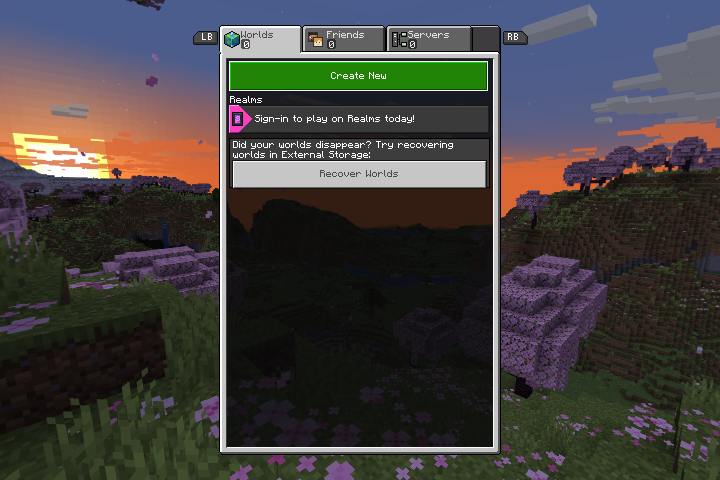

# Minecraft Bedrock for ARM Linux handhelds


*Standard edition on an RG34XX SP (left) and the RGDS edition on an RG DS
(right), sharing a LAN world. The RG DS lower screen is the companion.*

Run a legally owned Android copy of Minecraft Bedrock natively on supported
ARM Linux handhelds through PortMaster and the open-source minecraft-linux
launcher. This is a testing release: supported combinations are documented,
but the final R36S and revised RGDS physical acceptance checks are still
pending. Nothing in rc.14 is promoted to stable or newly labelled Validated.

> **No game files are included.** You must supply your own official Minecraft
> Bedrock Android APK or complete split-APK set.
>
> **NOT AN OFFICIAL MINECRAFT PRODUCT. NOT APPROVED BY OR ASSOCIATED WITH
> MOJANG OR MICROSOFT.**

## Download v2.0.0-rc.14

Download an install archive from the release
assets, not GitHub's automatically generated **Source code** archives.

| Download | Who needs it |
|---|---|
| [Standard edition](https://github.com/DankMiimer/minecraft-bedrock-handheld-port/releases/download/v2.0.0-rc.14/minecraftbedrock-standard-v2.0.0-rc.14.zip) | Normal single-screen PortMaster devices; supports aarch64 and armhf |
| [RGDS edition](https://github.com/DankMiimer/minecraft-bedrock-handheld-port/releases/download/v2.0.0-rc.14/minecraftbedrock-rgds-v2.0.0-rc.14.zip) | Anbernic RG DS on ROCKNIX/Sway; arm64 only |
| [Windows APK helper](https://github.com/DankMiimer/minecraft-bedrock-handheld-port/releases/download/v2.0.0-rc.14/mcbedrock-get-windows-v2.0.0-rc.14.zip) | Downloads your own Google Play purchase in the correct arm64 format. Source and issues: [mcbedrock-get](https://github.com/DankMiimer/mcbedrock-get) |
| [Linux APK helper](https://github.com/DankMiimer/minecraft-bedrock-handheld-port/releases/download/v2.0.0-rc.14/mcbedrock-get-linux-x86_64-v2.0.0-rc.14.AppImage) | The same helper for x86_64 Linux. Download, `chmod +x`, run. Newest version: [mcbedrock-get](https://github.com/DankMiimer/mcbedrock-get/releases/latest) |
| [Project source bundle](https://github.com/DankMiimer/minecraft-bedrock-handheld-port/releases/download/v2.0.0-rc.14/minecraftbedrock-source-v2.0.0-rc.14.zip) | Maintainers and license compliance; not an install archive |
| [Standard SPDX SBOM](https://github.com/DankMiimer/minecraft-bedrock-handheld-port/releases/download/v2.0.0-rc.14/minecraftbedrock-standard-v2.0.0-rc.14.spdx.json) | Machine-readable contents of the standard archive |
| [RGDS SPDX SBOM](https://github.com/DankMiimer/minecraft-bedrock-handheld-port/releases/download/v2.0.0-rc.14/minecraftbedrock-rgds-v2.0.0-rc.14.spdx.json) | Machine-readable contents of the RGDS archive |
| [Release notes](https://github.com/DankMiimer/minecraft-bedrock-handheld-port/releases/download/v2.0.0-rc.14/RELEASE_NOTES.md) | Short packaged release summary |
| [Checksums](https://github.com/DankMiimer/minecraft-bedrock-handheld-port/releases/download/v2.0.0-rc.14/SHA256SUMS.txt) | Verifies every published file |

Use the **standard edition** unless you own an RG DS and specifically want the
dual-screen companion. The standard edition intentionally redirects RGDS users
to the separate RGDS package instead of silently installing experimental code.

## What you need

- A supported ARM Linux handheld with a working PortMaster installation.
- About 2 GB of free space for the port, runtime, and extracted game.
- Your own copy of Minecraft Bedrock for **Android**, bought from Google Play.
  You will sign in with the Google account that owns it. A copy bought anywhere
  else — a console store, or the PC edition — will not work here.
- The right build for your device:

| Your device | Build to download |
|---|---|
| Most 64-bit handhelds, including H700 devices and RGDS | **64-bit** (`arm64-v8a`) |
| 32-bit R36S/RK3326-class firmware | **32-bit** (`armeabi-v7a`) |

If you are not sure which you have, install the port and launch it once. It
reports what it detected, and it does not need a Minecraft file to tell you.

## Quick start

### 1. Put the port on the SD card

Extract exactly one port archive at the root of the storage that contains your
ROM folders:

| Firmware | Extract to |
|---|---|
| muOS | SD-card root, normally `/mnt/mmc` or `/mnt/sdcard` |
| Knulli | Share root or second SD-card root, the location containing `roms/` and `ports/` |
| ROCKNIX | Games-partition root, shown on-device as `/storage/roms` |
| R36S-class PortMaster setup | Storage root containing `roms/ports/` |

The archive supplies launch entries under both `roms/ports/` and `ports/` so
the supported firmware layouts find the same payload. Refresh the Ports list,
then launch **Minecraft Bedrock** once. This creates the shared data folders.

### 2. Get your owned Bedrock APKs

There are two routes. Pick the first one if your device can use it.

#### On the device itself — no PC needed

Open **Get APK from Google Play** in the launcher menu. It signs you in on
Google's own page, downloads the build you choose, validates it and installs
it, all on the handheld. You need Wi-Fi, about 1.5 GB of free space for the
one-time browser runtime, and the Google account that owns Minecraft.

This is a prototype and it is limited to **64-bit H700 devices on muOS, Knulli
or Batocera** — an RG34XX-SP, RG35XX-H/Plus/2024 and relatives. The tile is
greyed out on anything else, which is not a bug: the sign-in browser needs a
graphics path only those devices have been proven on. Everyone else uses the
helper below.

Verified end to end on an RG34XX-SP running muOS 2601.0 JACARANDA on
2026-08-25: sign-in, download of the 1.16.221.01 split set, install, and a
clean play session with working controls and sound.

#### On a PC — the helper

On a Windows PC, use the helper —
[mcbedrock-get](https://github.com/DankMiimer/mcbedrock-get):

1. Download the newest `mcbedrock-get-windows-*.zip` from
   [its releases page](https://github.com/DankMiimer/mcbedrock-get/releases/latest)
   and unzip it, keeping all the files together in one folder.
2. Run `mcbedrock-get.exe`. Windows will warn about an unknown publisher
   because the file is not code-signed; check it against the published
   `SHA256SUMS.txt` if you would rather be sure.
3. Press the button in **step 1** of the window. It installs everything it
   needs by itself, including a copy of Ubuntu Linux — it explains what that
   involves and asks first. Expect one Windows administrator prompt, possibly a
   restart, and a few minutes of waiting.
4. Press the button again to **sign in** with the Google account that owns
   Minecraft, on Google's own page. The helper never sees your password.
5. Choose your device type, pick **1.16.221.01**, and press **Download**. Keep
   every file it produces together.

See [the complete Windows guide](GETTING-BEDROCK-APKS.md) for signing out,
32-bit instructions, and troubleshooting.

### 3. Copy and install the complete set

Copy the full APK or **every file from one split-set download** into:

```text
ports/minecraftbedrock-data/apk/
```

Launch the port, choose **Install APK**, select the detected set, and confirm.
Installation can take several minutes. The progress screen now stays visible;
do not power the device off while it is extracting.

The installer validates package identity, version, signing data, dependencies,
and ABI before publishing anything. Mixed or incomplete sets are rejected, and
a failed install leaves the original APKs and previous versions intact.

### 4. Play




Open **Versions**, select the installed build, then choose **Play**. The
launcher remembers the selection. After a successful install you may keep the
APKs for recovery or delete them from the launcher with **X**.

## Recommended Bedrock versions

| Version | Verdict | Why |
|---|---|---|
| **1.16.221.01** | **Recommended** | Menus and text are the right size on a small screen, and it runs the most smoothly of anything tested |
| **1.21.51.01** | Usable | The newest version without the slow graphics engine, but its menus are much smaller. Only the original release qualifies — the 1.21.51.02 re-upload switched that engine back on |
| 1.18.30 and newer | Not worth trying | These use RenderDragon, a graphics engine handhelds are far too slow for. Expect severe stuttering, and small menus |
| 1.26 and newer | **Will not work** | Google now protects these in a way the launcher cannot open |

The launcher identifies installed versions from Android metadata and the game
library hash, not from filenames. Exact status and evidence are in
[the compatibility registry](portmaster/minecraftbedrock/COMPATIBILITY.md).

## Launcher menu

- **Play** — start the selected version.
- **Versions** — select or remove installed game versions without deleting
  worlds.
- **Install APK** — install a validated full APK or complete split set.
- **Get APK from Google Play** — download your own purchase on the device.
  64-bit H700 devices on muOS, Knulli or Batocera only; greyed out elsewhere.
- **Settings** — configure FPS cap, render distance, client ABI, UI scale,
  VSync, performance tuning, and FPS logging.
- **Backup** — archive and restore profiles, worlds, and launcher settings.
- **Update port** — install the correct edition/channel update over the current
  code while preserving shared data.
- **Support bundle** — create a local redacted diagnostic archive.
- **Controller test** — record the detected pad and inputs locally.

Menu controls are D-pad to move, **A** to select, **B** to go back, **X** to
delete, and Left/Right to change settings. The launcher detects firmware
button-label differences; `MCPE_MENU_CONFIRM=a|b` remains available as an
advanced override.

For H700-class systems, start with a 30–40 FPS cap and 3–4 chunk render
distance. The port restores performance, display, frontend, and input state
after normal exit or a supervised failure.

## Updates and backups

Use **Backup** before testing a new game version, firmware, or port prerelease.
Backups contain launcher settings, profiles, and worlds, but never the supplied
APK or extracted version; keep the original complete APK set separately for
recovery. Use **Update port** to install updates for the current standard or
RGDS edition and selected channel. An update replaces port code only and keeps
the shared user-data directory intact.

## Standard and RGDS editions

Both editions share only user-owned data under:

```text
ports/minecraftbedrock-data/
  apk/       original installers
  versions/  validated extracted game versions
  profiles/  worlds and per-version player data
  backups/   local backup archives
```

Their code, logs, runtime, caches, update channel, and temporary state remain
separate. Updating one edition cannot overlay the other.

The RGDS edition adds a five-tab lower-screen companion with HUD, Chat, Items,
Input, and Settings pages, live status, a local-world terrain map, touch
routing, on-screen keyboard supervision, and SELECT screen swapping. Its
supported host is RGDS on ROCKNIX/Sway. Non-ROCKNIX RGDS systems are
experimental.

When you join a world hosted by another device, Bedrock does not store that
host's LevelDB world database locally. RGDS therefore keeps live status but
shows `REMOTE WORLD / MAP UNAVAILABLE` and clears old local terrain instead of
displaying a misleading cached map.

## Updating from 1.x

The first 2.x launch migrates APKs, installed versions, profiles, and backups
into the shared data directory. It inventories both locations first, refuses
ambiguous collisions, writes a recovery manifest, and keeps rollback state
until the first clean game exit.

Do not delete an old installation before this migration. If the launcher
reports that both old and new locations contain data, move one copy aside and
launch again; it will not choose one destructively.

## Troubleshooting

| Symptom | What to do |
|---|---|
| Installer says the set is incomplete | Copy every file from one single download. Do not mix files from downloads made on different days, or of different versions |
| Game installs but does not start | Confirm `arm64-v8a` for most 64-bit systems or `armeabi-v7a` for armhf firmware |
| Installation appears frozen | Wait for the progress stage to complete; large asset extraction can take several minutes |
| Tiny UI or heavy stutter | Select 1.16.221.01 and start with 30–40 FPS and 3–4 chunks |
| R36S reports no matching video mode | Use rc.3 or newer; the launcher now selects an actual connected DRM mode instead of assuming 640×480 |
| Buttons are wrong | Run **Controller test**, then include its redacted output in a device report |
| Black screen or failed relaunch | Reboot once, then create a **Support bundle** before changing files manually |
| Windows helper cannot find WSL | Install Ubuntu with `wsl --install -d Ubuntu`; set `MCBEDROCK_WSL_DISTRO` only when using a differently named Ubuntu distro |
| Windows helper hangs at “Passing your Google session” | Replace rc.3 with rc.4 or newer; rc.3 could loop in upstream interactive authentication until its five-minute timeout |
| Windows helper says Minecraft is for sale | Sign out and use the Google account that owns the Google Play Android edition |

See [SUPPORT.md](SUPPORT.md) for report requirements. Never upload APKs,
extracted game libraries/assets, worlds, account data, private server details,
`versions/`, `profiles/`, or `libminecraftpe.so`.

## Maintainers and source

- [Testing evidence](TESTING.md)
- [Release checklist](RELEASE_CHECKLIST.md)
- [Source build and patch information](source_release/README.md)
- [Legal notes](LEGAL.md) and [third-party notices](THIRD_PARTY_NOTICES.md)
- [Downloader safety policy](DOWNLOADER-POLICY.md): open source, no bypasses,
  no third-party handling of credentials, and the checks that enforce all three
  across both the on-device downloader and the mcbedrock-get helper
- [Credits](CREDITS.md) and [contribution guide](CONTRIBUTING.md)

`VERSION` is the release authority. Pinned containers build the standard
aarch64/armhf clients, RGDS client and companions, and the context bridge.
Release assembly creates deterministic edition archives, SPDX SBOMs, source
materials, checksums, and an edition-aware updater index. See the checklist
before promoting any prerelease to stable.

Port by DankMiimer.
